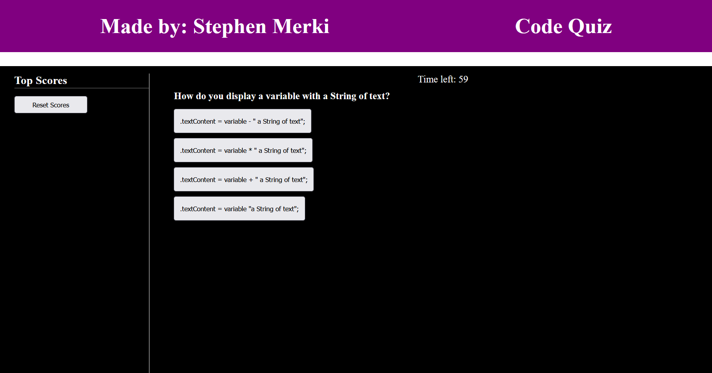
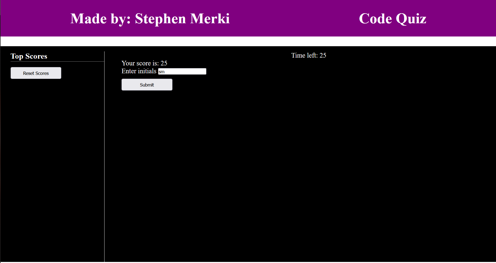
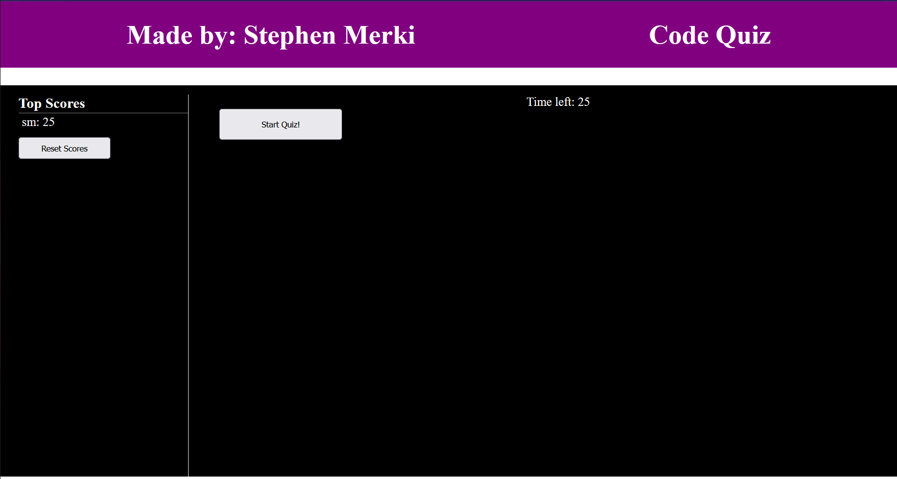

# Stev232sCodeQuiz

## Description

In this project I am creating a quiz generator with a scoreboard. This project will be utilizing Event handlers to identify when an answer is selected. This project will also utilize a timer that will be used to identify the user score and tell when the user runs out of time.

## Acceptance Criteria

GIVEN I am taking a code quiz 
*WHEN I click the start button* 
__THEN__ a timer starts and I am presented with a question 
*WHEN I answer a question* 
__THEN__ I am presented with another question 
*WHEN I answer a question incorrectly* 
__THEN__ time is subtracted from the clock 
*WHEN all questions are answered or the timer reaches 0* 
__THEN__ the game is over 
*WHEN the game is over* 
__THEN__ I can save my initials and score 

## ScreenShots

## Deployment Link

https://stev232.github.io/Stev232sCodeQuiz/